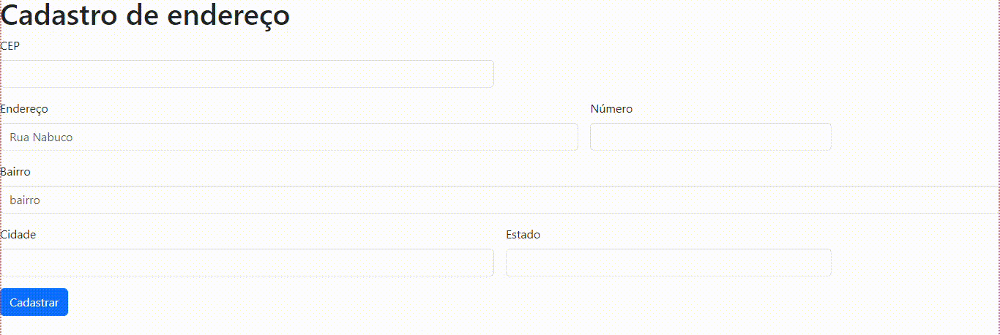

# form-CadEndereco 
# índice

[Projeto- CADASTRO DE ENDEREÇO](#projeto---cad-de--endereço)  
[Descrição](#descri%C3%A7%C3%A3o)  
[Introdução](#introdu%C3%A7%C3%A3o)  
[Funcionalidades](#funcionalidades)  
[Tecnologia utilizada](#tecnologia-utilizadas)  
[Fontes consultadas](#fontes-consultadas)  
[Autores](#autores)  

# Projeto Cadastro 🚀 - criando um sistemema de cadastro
Com base no exercício feito em sala, pegamos um código pronto do Bootstrap sobre um formulario de cadastro.

 

## 𝐃𝐄𝐒𝐂𝐑𝐈𝐂̧𝐀̃𝐎📝
 O projeto de formular cadastro é uma maneira que encontramos para manter as informações dos clientes organizadas.

 ## 𝗜𝗡𝗧𝗥𝗢𝗗𝗨𝗖̧𝗔̃𝗢 📌
Ferramenta que auxilia as empresas a manter as informações organizada
A ferramenta foi criada para facilitar e ajudar as empresas com suas organizações.

## 𝐅𝐔𝐍𝐂𝐈𝐎𝐍𝐀𝐋𝐈𝐃𝐀𝐃𝐄𝐒  ⚙️
Ao acessar essa ferramenta o usuário sera direcionado para uma página, lá esta pedindo as seguintes funções, sendo elas: 
  - `𝘤𝘦𝘱`: O usuário terá que colocar o cep. 𝓔𝔁𝓮𝓶𝓹𝓵𝓸 :124352718  
 -  `𝘦𝘯𝘥𝘦𝘳𝘦𝘤̧𝘰`: Esse campo será utilizado para adiconar o Endereço. 𝓔𝔁𝓮𝓶𝓹𝓵𝓸: Rua das maritacas  
  - `𝘯𝘶𝘮𝘦𝘳𝘰`: O usuario devera colocar o numero de sua residencia. 𝓔𝔁𝓮𝓶𝓹𝓵𝓸: 123
   - `𝑐𝑖𝑑𝑎𝑑𝑒​`: Aqui o úsuario devera colocar sua cidade. 𝓔𝔁𝓮𝓶𝓹𝓵𝓸: Londrina
 - `𝘦𝘴𝘵𝘢𝘥𝘰`:  E para finaliza o usuario devera colocae seu estado. 𝓔𝔁𝓮𝓶𝓹𝓵𝓸: Parana

    
 
 ### Tecnologias utilizadas ⌨️
 * HTML
 * JAVASCRIPT
 * GITHUB
 * STYLE
 * BOOTSTRAP

## Fontes consultadas 🔍
[bootstrap] https://getbootstrap.com/

## Autores ✒️
[veronica] https://github.com/veronicarodrigues07/Form-cadastro

